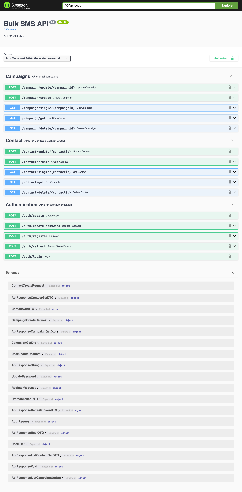

# Bulk SMS API with Spring Boot


## Overview

This repository contains a simple Spring Boot application for managing and sending bulk SMS. It includes key features like user authentication, contact management, campaign creation, and SMS dispatch functionality. 

The API is designed to be lightweight and easy to integrate into existing systems. Feel free to adapt this template to suit your project more closely! Let me know if you'd like to explore any of these sections in greater detail.


## Features

- **User Authentication:** Secure user login and access management.

- **Manage Contacts:** Create, update, delete, and retrieve contacts.

- **Campaigns:** Build SMS campaigns and schedule bulk messages.

- **Send Bulk SMS:** Send SMS to multiple recipients in a single operation.

- **Dynamic Campaign Message:** Send customised sms based on the data uploaded.


## Technologies Used

- **Backend Framework:** Spring Boot

- **Database:** MySQL

- **Authentication:** JWT (JSON Web Tokens)

- **Dependencies:**

  - Spring Security

  - Spring Data JPA

  - Hibernate

  - Use your SMS provider


## Prerequisites

Before running this project, ensure you have:

- Java 21 or later installed

- Maven installed

- A database setup (e.g., MySQL)

- An SMS provider account with API credentials


## Installation

1. Clone the repository:

   ```bash

   git clone https://github.com/Nabanyi/BulkSMS-Backend.git

   ```

2. Navigate to the project directory:

   ```bash

   cd BulkSMS-Backend

   ```

3. Configure the database and SMS provider in `application.properties`:

   ```properties

   # Database configuration

   spring.datasource.url=jdbc:mysql://localhost:3306/bulksms

   spring.datasource.username=yourusername

   spring.datasource.password=yourpassword

   ```

4. Configure the database and SMS provider in `/service/SmsService.java`:

   ```SmsService

   # SMS provider credentials

   API_KEY=yourapikey

   SMS_URL=URL

   BALANCE_URL=URL

   ```

5. Build the project:

   ```bash

   mvn clean install

   ```


6. Run the application:

   ```bash

   mvn spring-boot:run

   ```


## API Endpoints

Below are some of the key endpoints provided by this API:



## Contributing

Contributions are welcome! Feel free to open issues or submit pull requests to improve this project.


## License

This project is licensed under the [MIT License](LICENSE).


## Contact

For inquiries, you can reach out via:

- GitHub: [@Nabanyi](https://github.com/Nabanyi)

